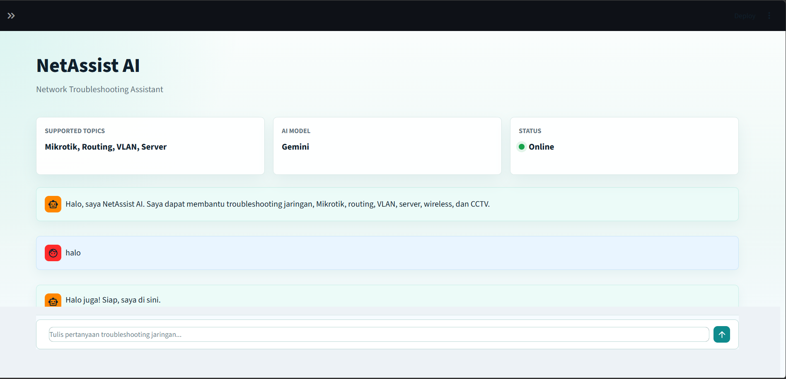
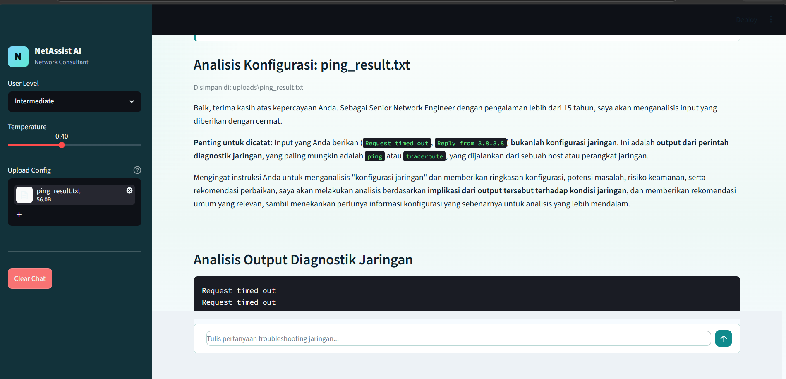

# NetAssist AI

NetAssist AI adalah aplikasi chatbot konsultan jaringan komputer berbasis Streamlit dan Google Gemini API. Aplikasi ini dirancang untuk membantu administrator jaringan, teknisi IT, mahasiswa, dan pengguna umum melakukan troubleshooting jaringan secara sistematis.

## Fitur

- Chatbot AI dengan peran Senior Network Engineer.
- Dukungan topik Mikrotik, Cisco, Routing, Switching, VLAN, DHCP, DNS, Firewall, Wireless, CCTV, Linux Server, Windows Server, dan Network Troubleshooting.
- Pilihan level pengguna: Beginner, Intermediate, dan Expert.
- Kontrol temperature Gemini dari 0.0 sampai 1.0.
- Riwayat percakapan menggunakan `st.session_state`.
- Tombol Clear Chat untuk menghapus percakapan.
- Welcome message saat aplikasi pertama kali dibuka.
- Upload konfigurasi Mikrotik `.rsc` atau `.txt`.
- Analisis konfigurasi meliputi ringkasan, potensi masalah, risiko keamanan, dan rekomendasi perbaikan.
- UI dashboard modern dengan sidebar dan KPI cards.

## Instalasi

1. Clone atau buka folder project ini.

2. Buat virtual environment.

```bash
python -m venv .venv
```

3. Aktifkan virtual environment.

Windows PowerShell:

```powershell
.venv\Scripts\Activate.ps1
```

macOS atau Linux:

```bash
source .venv/bin/activate
```

4. Install dependency.

```bash
pip install -r requirements.txt
```

## Cara Mendapatkan Gemini API Key

1. Buka Google AI Studio: https://aistudio.google.com/
2. Login menggunakan akun Google.
3. Masuk ke menu API Keys.
4. Buat API key baru.
5. Salin API key tersebut ke file `.env`.

Buat file `.env` berdasarkan `.env.example`.

```env
GEMINI_API_KEY=isi_api_key_anda
GEMINI_MODEL=gemini-1.5-flash
```

## Cara Menjalankan Aplikasi

Jalankan perintah berikut dari root project:

```bash
streamlit run app.py
```

Setelah server Streamlit aktif, buka URL lokal yang muncul di terminal.

## Screenshot Placeholder

Tambahkan screenshot aplikasi pada bagian ini setelah aplikasi dijalankan.

```text
assets/screenshot.png
```

## Struktur Folder

```text
netassist-ai/
|
├── app.py
├── requirements.txt
├── README.md
├── .env.example
├── .gitignore
|
├── assets/
└── uploads/
```
## Screenshot





## Catatan Keamanan

- Jangan commit file `.env` ke repository.
- Direktori `uploads/` diabaikan oleh Git karena dapat berisi konfigurasi jaringan sensitif.
- Periksa ulang rekomendasi AI sebelum diterapkan ke perangkat produksi.
